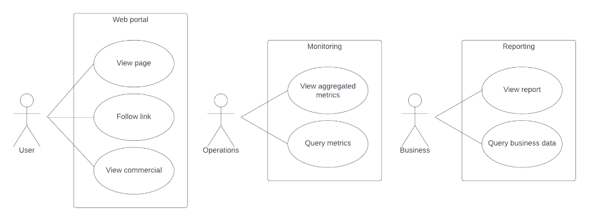

# Introduction to Data Engineering
## Day 6 - Bigger Picture
This directory contains files related to the daily activity for day 6 of the module. We encourage students to prepare several variants of the solutions.

*The diagrams can be drawn using eg. [diagrams.net](https://www.diagrams.net) or [Lucid](https://lucid.app) tool.*

### Task 1
Design the data architecture, i.e. how the data can be stored and processed for a web portal.
It contains categorized articles and advertisements that are read by users. Each of them has an identifier stored as a cookie. The portal tracks every user action. It is a very popular portal, so the amount of data created is measured in gigabytes per second.
They are then used for two purposes:
- monitoring (hourly): the data should be filtered and aggregated by user location and categories,
- reporting (daily): the data is linked to the types of users and analyzed in terms of advertising sales, which requires intensive calculations.

### Task 2
A truck route management application should provide the following functionalities:
- calculation of the truck's travel time through the section basis on its length, weather, and actual measurements (tracking),
- optimization of truck route planning to minimize unloaded journeys.

Design the data architecture for such an application.
The following data should be stored: drivers, trucks, transport orders, routes, and travel time measurements during specific weather conditions.
Weather data is provided by an external service.
